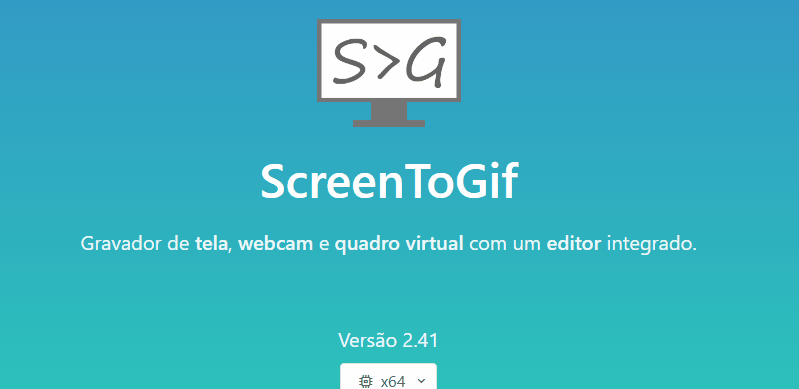

# Projeto com Readme
Um projeto de teste com um arquivo Readme. 🐱‍💻

[]

## Tecnologias utilizadas
- HTML
- CSS
- JS

## Como utilizar
1. Clone o projeto
```
git clone <url>

```
2. Acesse a pasta do projeto
```
cd repositorio-com-readme

```